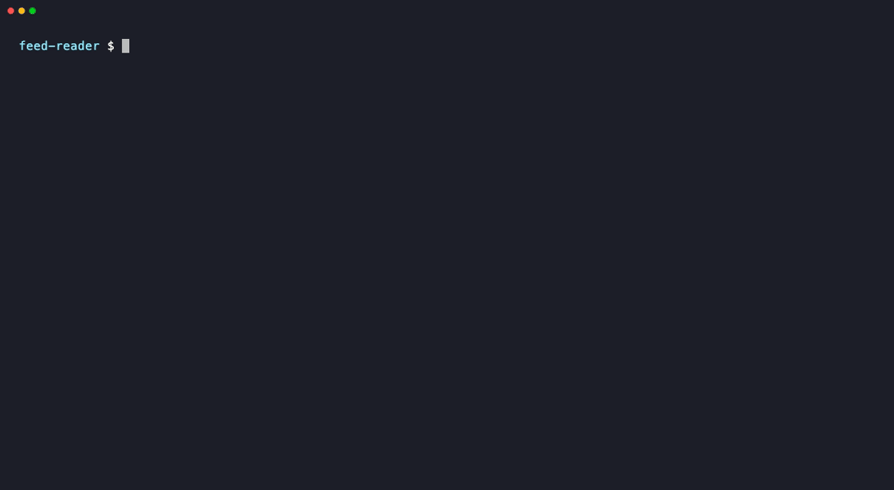

# fixedin

[](https://www.npmjs.com/package/fixedin)
[](https://github.com/knsorrigle/fixedin/actions/workflows/ci.yml)

**Paste an error. Find out if it was already fixed upstream, in which release, and whether _your_ installed version has the fix.**



```
$ pbpaste | fixedin --repo axios/axios

  ✖ axios: "Cannot read properties of undefined (reading 'create')" (fixed upstream — upgrade)
    Matched: axios/axios#5011 (closed) — similarity 1.00
             [1.0.0] TypeError: Cannot read properties of undefined (reading 'create')
    Fixed by: PR #5162 → shipped in v1.2.0
    Release note: "changed: refactored module exports #5162"
                  https://github.com/axios/axios/releases/tag/v1.2.0
    You have: 1.1.3 (from package-lock.json)
    → Upgrade to >=1.2.0
```

That's a real case: in axios 1.0.x, `require('axios').default` was undefined. fixedin found the issue, traced it to the PR that closed it, found the first npm release containing that PR's merge commit, and compared it with the version in your lockfile.

No LLM, no embeddings, no vector database — it uses GitHub's own hybrid (semantic + lexical) issue search, the issue timeline, and git history.

## Install

Requires Node.js 20+.

```bash
npx fixedin "TypeError: Cannot read properties of undefined (reading 'headers')"
```

or install it once and use `fixedin` anywhere:

```bash
npm install -g fixedin
```

To hack on it, see [CONTRIBUTING.md](CONTRIBUTING.md) for running from source.

## Usage

```bash
# An error message as an argument
fixedin "Error [ERR_REQUIRE_ESM]: require() of ES Module not supported"

# A whole stack trace on stdin (best: package names come from node_modules/ paths)
pbpaste | fixedin
npm test 2>&1 | fixedin

# Error thrown from your own code (no node_modules frames)? Name the repo.
pbpaste | fixedin --repo axios/axios

# Machine-readable
pbpaste | fixedin --json | jq '.results[].verdict.kind'
```

| Flag | Default | |
|---|---|---|
| `--cwd <dir>` | current dir | Project whose lockfile to read (searches upward, so monorepo packages work; in pnpm, yarn, Bun and Deno workspaces it also picks which package's dependencies count) |
| `--repo <owner/name>` | detected | Search this repo instead of the ones found in the stack trace |
| `--limit <n>` | `5` | Matches to show per repo |
| `--json` | | Stable JSON output (see [schema](#json-output)) |
| `-v, --verbose` | | Every search query, trace step, release probe, cache hit and remaining API quota |
| `--no-cache` | | Don't read or write `~/.cache/fixedin` |
| `--markdown` | | GitHub-flavored markdown, for PR comments and job summaries |
| `--exit-code` | | Exit **1** if a released fix exists that you don't have, **2** if fixedin couldn't tell (error, bad arguments, a search failed), else **0** |

## GitHub Action

When tests fail in a pull request, fixedin can say whether the failure is already fixed upstream — in the job summary and as a comment on the PR (updated on each run, never duplicated):

```yaml
permissions:
  contents: read
  pull-requests: write   # only for the PR comment

jobs:
  test:
    runs-on: ubuntu-latest
    steps:
      - uses: actions/checkout@v5
      - run: npm ci
      - name: Test
        shell: bash
        run: npm test 2>&1 | tee test.log

      - name: Already fixed upstream?
        if: failure()
        uses: knsorrigle/fixedin@v0.6.0
        with:
          log: test.log
```

| Input | Default | |
|---|---|---|
| `log` | *(required)* | File with the failing output |
| `working-directory` | `.` | Project whose lockfile says what's installed |
| `repo` | | Search this repo (`owner/name`) instead of detecting packages |
| `comment` | `true` | Comment on the pull request (needs `pull-requests: write`; fork PRs get a read-only token, so it's skipped with a warning) |
| `fail-on-fix` | `false` | Fail the step when a released fix exists that you don't have |
| `github-token` | `github.token` | Token for GitHub search and the comment |
| `version` | the action's own version | fixedin version to run from npm |

Outputs: `fix-available` (`"true"`/`"false"`), `exit-code` (as for `--exit-code`), `report` (path to the `--json` report) and `markdown` (path to the markdown report). The action runs the fixedin release matching its tag, so `@v0.6.0` keeps behaving the same when newer versions ship. Issue titles and release notes in the comment are escaped so they can't @-mention anyone, link to issues in your repo, or inject HTML.

## Use in CI

With `--exit-code`, fixedin's answer is usable in scripts: **1** means "this failure is already fixed upstream — upgrade", **0** means nothing to upgrade to (no match, you already have the fix, the issue is open, or the fix isn't released), **2** means fixedin couldn't tell. A found fix wins: if one repo's search fails but another finds a fix, the exit code is 1.

For example, in GitHub Actions — explain a failed test run and flag failures that an upgrade would fix:

```yaml
- name: Test
  shell: bash          # sets -o pipefail, so a failing `npm test` fails the step despite `tee`
  run: npm test 2>&1 | tee test.log

- name: Is this already fixed upstream?
  if: failure()
  shell: bash
  env:
    GITHUB_TOKEN: ${{ secrets.GITHUB_TOKEN }}
  run: |
    status=0
    npx fixedin --exit-code < test.log || status=$?
    if [ "$status" = 1 ]; then echo "::warning::A released upstream fix exists for this failure — see the fixedin output above."; fi
```

## Verdicts

| Verdict | Meaning |
|---|---|
| `FIXED_UPSTREAM_UPGRADE` ✖ | A matching issue was fixed and released; your installed version is older. Upgrade. |
| `ALREADY_HAVE_FIX` ! | Your version already contains the fix. You're probably hitting a *different* bug with the same message. |
| `FIX_UNRELEASED` ◐ | The fix is merged but no npm release contains it yet. |
| `OPEN_ISSUE` ● | Known, still open. If a comment in the thread looks like a workaround (code block or many 👍), it's shown. |
| `CLOSED_NO_FIX_FOUND` ? | A matching issue is closed, but no fixing PR/commit could be traced (closed manually, stale bot, "not planned", or no GitHub token). |
| `NO_MATCH` ○ | Nothing similar enough. Might be new — consider reporting it. |

Matches with similarity between 0.60 and 0.75 are labelled **weak match**: treat those verdicts as a lead, not an answer.

## How it works

```
error text ─► parse ─► lockfile ─► resolve ─► search ─► trace ─► release ─► verdict
```

1. **parse** — picks the error line, strips paths / line:col / hex addresses / UUIDs / IPs, extracts error codes (`ERR_*`, errno codes, Prisma `P####`), and collects packages from `node_modules/<pkg>/` stack frames (including pnpm and Vite's `.vite/deps` paths), Deno's npm cache paths (`…/deno/npm/registry.npmjs.org/<pkg>/<version>/`) and "Cannot find module" messages. Test-runner frames (jest, vitest, …) are ranked last.
2. **lockfile** — reads the installed version from the nearest lockfile, falling back to `node_modules/<pkg>/package.json`:

   | Lockfile | Versions |
   |---|---|
   | `package-lock.json` / `npm-shrinkwrap.json` | lockfileVersion 1–3 (npm 5+) |
   | `pnpm-lock.yaml` | 5.x, 6.0, 9.0 (pnpm 7+) |
   | `yarn.lock` | classic (yarn 1) and Berry (yarn 2+), including yarn catalogs |
   | `bun.lock` | 0–2 (Bun 1.1.39+); the binary `bun.lockb` is detected and fixedin says how to convert it |
   | `deno.lock` | 3–5 (Deno 1.40+), npm packages only |

   **The copy that threw wins.** When a stack frame shows which copy ran, fixedin uses that copy, not the top-level one, and says so ("0.25.0 at node_modules/wait-on/node_modules/axios — the copy in the stack trace; top-level axios is 1.1.3"). Nested npm paths are matched against the lockfile; pnpm, Bun, yarn PnP and Deno paths embed the version, so those work even without a lockfile.

   `npm:` aliases resolve to the real package. In a workspace, the package containing `--cwd` decides which version counts, so `packages/web` and `packages/api` can get different verdicts for the same error. No YAML or JSONC library is involved: small readers handle exactly what each tool writes, and fail with a line number or reason on anything else.
3. **resolve** — maps each package to its GitHub repo via the `repository` field on npm (handles `git+https`, `github:` shorthand, ssh URLs and monorepo `directory`), then asks GitHub for the repo's current name (search doesn't follow renames, e.g. `prisma/prisma` → `prisma/orm`).
4. **search** — `GET /search/issues` with `search_type=hybrid`, scoped to `repo:<owner/name> is:issue`. GitHub reports which mode actually ran; fixedin records it and falls back to lexical search when hybrid is unavailable. Because GitHub scores every hit `1.0`, results are re-ranked locally by weighted word overlap with the title and body, with a bonus when the message appears verbatim. Most JS errors are a template around one identifier, so that identifier must appear *in the same role*: for "adapter is not a function", an issue about "setKeepAlive is not a function" is capped below the match threshold even if it mentions "adapter" elsewhere. The same goes for `reading 'X'` and "Cannot find module 'X'".

   Messages with no identifier ("fetch failed", "Cannot use import statement outside a module") are matched by *where* they failed instead: fixedin keeps the package's frames from your trace (`invokeRequest` in `next/dist/server/lib/server-ipc/invoke-request.js`), runs one extra search for them, and treats an issue that pasted the same throw site as a match — and one that pasted a *different* path through the same package as a different bug. Frames every error passes through (a library's error factory like `AxiosError.from`, or Prisma's `handleRequestError`) are ignored, and bundler chunk hashes are stripped so traces from different builds still compare.
5. **trace** — reads the issue's GraphQL timeline for the fix: the PR or commit that closed it, a linked PR, or (flagged as inferred) a same-repo PR merged just before a manual close. References from other repos — usually downstream "bump dependency" PRs — are ignored. Duplicates are followed one hop.
6. **release** — finds the earliest npm release whose source contains the fix's merge commit. A fix merged into a maintenance branch (`v3.1`, `1.x`) is looked for on that release line — later mainline releases usually don't contain the backport commit. Each version maps to a commit through npm's `gitHead`, or a git tag (`v1.2.3`, `1.2.3`, `pkg@1.2.3`, …) when `gitHead` is missing. Containment is `GET /repos/{o}/{r}/compare/{fix}...{release}` (`ahead`/`identical` = contains). Versions are binary-searched, limited to releases published after the merge and on or above your major version, so it's a handful of API calls, not hundreds.
7. **verdict** — compares with your installed version. The installed release is also checked directly against the fix commit, which beats semver when fixes are backported. It quotes the release-note line for the fix — from the GitHub release, or the project's changelog (the package's own directory in a monorepo, then the root), matched by the fix's PR, issue or commit within that version's section — and warns when the upgrade crosses a major version.
8. **remedy** — "upgrade to >=X" only works for packages you depend on directly. When the copy that threw was pulled in by another package, fixedin finds that parent in the lockfile, reads the range it declares, and tells you what actually gets the fix in:

   ```
   You have: 1.1.3 (from package-lock.json)
   Comes from: @nestjs/axios@1.0.0 (requires axios 1.1.3)
   → Upgrade @nestjs/axios to >=1.0.1 (it requires axios 1.2.1, which has the fix)
     or force it in package.json: {"overrides":{"@nestjs/axios":{"axios":"^1.2.0"}}}
   ```

   - **refresh** — the parent's range already allows a fixed version and only your lockfile is stale (`npm update axios`, `pnpm update axios`, `yarn up -R axios`, `bun update axios`; for yarn 1 and Deno, the steps that actually work)
   - **upgrade the parent** — to its first release whose range includes the fix (or that drops the dependency), flagging major upgrades
   - **override** — when no parent release accepts the fix, in your package manager's syntax (`overrides`, `pnpm.overrides`, `resolutions`)

   Every command and override form was checked against the real package managers.

Every failure is reported with what was tried and why it failed — use `--verbose` to see all of it.

## GitHub token

fixedin looks for a token in `GITHUB_TOKEN`, then `GH_TOKEN`, then `gh auth token` (GitHub CLI). No special scopes are needed for public repos.

Without a token it still runs, but:
- hybrid search is unavailable (GitHub requires auth for it), so only lexical search is used;
- fix tracing is skipped (GitHub's GraphQL API requires auth);
- rate limits are much lower.

## Cache and rate limits

Responses are cached in `~/.cache/fixedin` (or `$XDG_CACHE_HOME/fixedin`, or `$FIXEDIN_CACHE_DIR`):

| Request | Kept for |
|---|---|
| Compare between two commit SHAs | forever (both ends are immutable) |
| Compare against a tag | 24 hours |
| Issue search | 24 hours |
| Everything else (npm metadata, timelines, comments) | 1 hour |

Only fields fixedin reads are stored — a compare response shrinks from ~470 KB to a few bytes. Use `--no-cache` to bypass it. A repeat run is typically instant and uses no API quota.

GitHub's hybrid search allows **10 requests per minute**. fixedin reads the `x-ratelimit-*` headers, waits (up to 60 s, and says so on stderr) when a limit is hit, retries 5xx errors with backoff, and otherwise reports when the quota resets. `--verbose` prints the remaining quota for each bucket.

## JSON output

`--json` prints a report validated against a [zod](https://zod.dev) schema before it's written. The schema is exported for TypeScript users and published as JSON Schema in [`docs/report.schema.json`](docs/report.schema.json).

```ts
import { ReportSchema, type FixedinReport } from 'fixedin';

const report: FixedinReport = ReportSchema.parse(JSON.parse(stdout));
for (const r of report.results) console.log(r.package, r.verdict.kind, r.verdict.fixedIn);
```

Every optional field is present as `null` rather than omitted. Additive changes keep `schemaVersion: 1`; breaking changes bump it.

## Limitations

- npm packages only in v1. Deno's `jsr:` and URL imports aren't checked, and Bun's binary `bun.lockb` isn't read (fixedin says so and falls back to `node_modules`).
- Errors thrown from your own code have no `node_modules/` frames, so fixedin can't guess the package — use `--repo`.
- The similarity score is word overlap plus the identifier and stack-frame rules above, not semantic understanding. A message with neither an identifier nor an informative frame (a network error like "connect ECONNREFUSED", or Prisma's "Unique constraint failed") can still match loosely; watch for the *weak match* label.
- The release search assumes containment is monotonic in semver order after the merge date. Cherry-picked backports can break that; the direct check of your installed version guards the verdict itself.
- Issue threads longer than 100 comments are only partly scanned for workarounds; timelines longer than 500 events are only partly read (both are reported).

## Contributing

See [CONTRIBUTING.md](CONTRIBUTING.md). Wrong verdict? Please [open an issue](https://github.com/knsorrigle/fixedin/issues/new/choose) with the `--json` output — it contains everything needed to reproduce it.

## License

[MIT](LICENSE)
